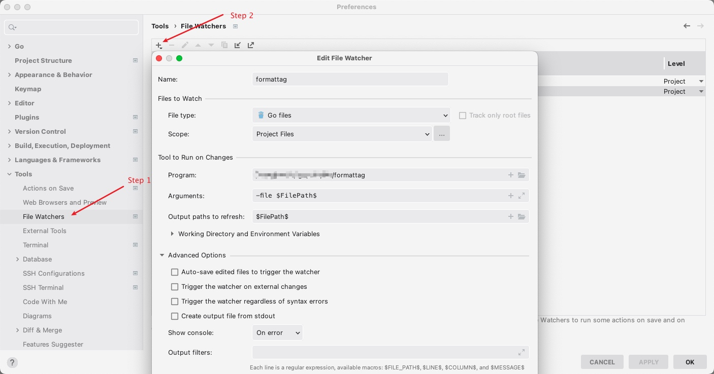

## Formattag

The tool is used to align golang struct's tags.

eg.:

Before
```golang
// TestStruct this is a test struct
type TestStruct struct {
	ID            string `json:"id" xml:"id"`
	IfNotModified string `json:"if_not_modified" xml:"if_not_modified"`
	Name          string `json:"name" xml:"name"`

	ThisIsAStructWodeTianNa struct {
		FieldFromThisIsAStructWodeTianNa string `json:"field_from_this_is_a_struct_wode_tian_na" xml:"field_from_this_is_a_struct_wode_tian_na"`
		TianName                         string `json:"tian_name" xml:"tian_name"`
	} `json:"this_is_a_struct_wode_tian_na" xml:"this_is_a_struct_wode_tian_na"`

	T    time.Time `json:"t" xml:"t"`
	Fset Fset      `json:"fset" xml:"fset"`
}

type Fset struct{}

```

After
```golang
// TestStruct this is a test struct
type TestStruct struct {
	ID            string `json:"id"              xml:"id"`
	IfNotModified string `json:"if_not_modified" xml:"if_not_modified"`
	Name          string `json:"name"            xml:"name"`

	ThisIsAStructWodeTianNa struct {
		FieldFromThisIsAStructWodeTianNa string `json:"field_from_this_is_a_struct_wode_tian_na" xml:"field_from_this_is_a_struct_wode_tian_na"`
		TianName                         string `json:"tian_name"                                xml:"tian_name"`
	} `json:"this_is_a_struct_wode_tian_na" xml:"this_is_a_struct_wode_tian_na"`

	T    time.Time `json:"t"    xml:"t"`
	Fset Fset      `json:"fset" xml:"fset"`
}

type Fset struct{}
```

### Installation

####  Compile from source
Compile from source, which requires [Go 1.18 or newer](https://golang.org/doc/install):
```
git clone github.com/momaek/formattag
cd formattag && go build .
```

#### Prebuild binaries
Please check the [release page](https://github.com/momaek/formattag/releases) and download the lastest release.

### Usage

```
formattag -file /path/to/your/golang/file
```

**This command will change your go file.**

If you want print result on console:
```
formattag -file /path/to/your/golang/file -C 
```

You can also get input from stdin(result will be print on console):
```
cat /path/to/your/golang/file | formattag
```

#### Vim
If you're using vim or nvim, you'd better install from source.

Add the following snippet to your ~/.vimrc:
```
set rtp+={/path/to/your/downloaded/source}/formattag/vim
```
Running `:PrettyTag` will run formattag on the current file.

Optionally, add this to your `~/.vimrc` to automatically run `formattag` on :w
```
autocmd BufWritePost,FileWritePost *.go execute 'PrettyTag' | checktime
```

#### VSCode
Please Install [Run On Save](https://marketplace.visualstudio.com/items?itemName=emeraldwalk.RunOnSave)
Add the following code snippet to `settings.json`.
```json
{
    "match": "\\.go$",
    "isAsync": false,
    "cmd": "/path/to/formattag -file ${file}"
}
```

#### GoLand
e.g.

